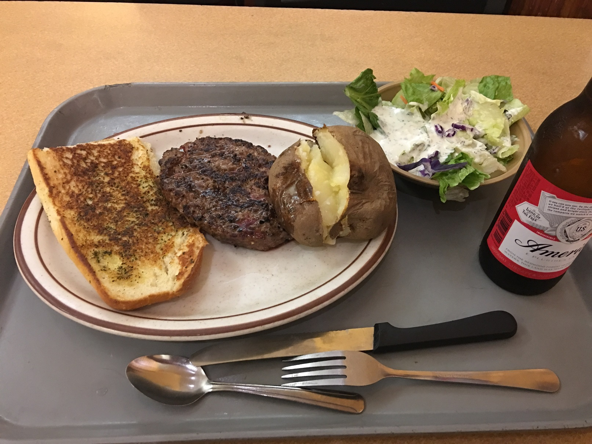

# 0日目（出国日）
自宅から出たのは１２時半過ぎ。１７時過ぎに便が出る予定ではあったので、少し余裕を持ちすぎたかと思ったが、
WIFI受け取り、両替で（特に後者）結構時間を食ってしまったので、もう少し余裕があったほうが良かったかも。

オンラインチェックインしていたおかげで面倒なカウンター手続きがまったくなかったので、今後の参考にしたい。

ラウンジはいろいろと優雅な環境ではあったが、人が多いのでなかなか寛げず。時間がなかったことも含めて、無計画だった。

航路が混んでいたようで、出発まで２０分ほど時間がかかったが、シートのおかげで苦にならず。
お酒も何でも飲み放題なのがすごかった。（喉が渇いた状態で乗ってしまったので、最初に注文したのはコーラ。）

睡眠はしたものの２，３時間程度しか寝られず。（どちらかと言うともったいないという気持ちが起きた要因）

着陸後の入国審査で軽く１時間ぐらいかかった。全く時間がかかっていないレーンは何が違ったんだろう。
聴く力があまりにも低いため、入国審査のおじさんの質問はすべて二回以上繰り返させてしまった。しょうがないよね。
質問はざっくりこんな感じ。おなじ質問をされたのは何だったんだろう。ちゃんと伝わらなかったのかな。
- なんの目的で入国するの？
- 何日間滞在するの？
- スナックとか花とか持ち込んでないよね？
- １週間滞在？
- 手荷物以外の荷物はいくつ預けた？
- こっちに友達はいる？

荷物をピックアップしてゲートを出るとツアーの方がいたので、他の方とともにホテルへ。

説明会（ホテルや同時通訳マイク）の準備のため、２時間ほど市街を散策。機内で目一杯食べた影響で
お腹が空いていないこともあって、1時間半ほどぶらついた後、スーパーでパッサパササンドイッチとドリンク、ガムを購入してユニオンスクエアで食べた。
ユニオンスクエアは韓国のイベントが開催されており、一日中賑やかだった。
散策の途中までwifiを使えていたはずのiPhoneが、いきなり使えなくなってしまって焦ったが、原因不明のママ。

チェックイン後は部屋で待機。1時間ほど寝てレポートを書いたりネット見たりした。
WifiはPC経由だと使えた。iPhoneがiOS10だから使えないとかそういう寒いオチではないことを祈りたい

夕食はハンバーガー。おいしく頂きました。

明日の予定を考えつつ就寝。
