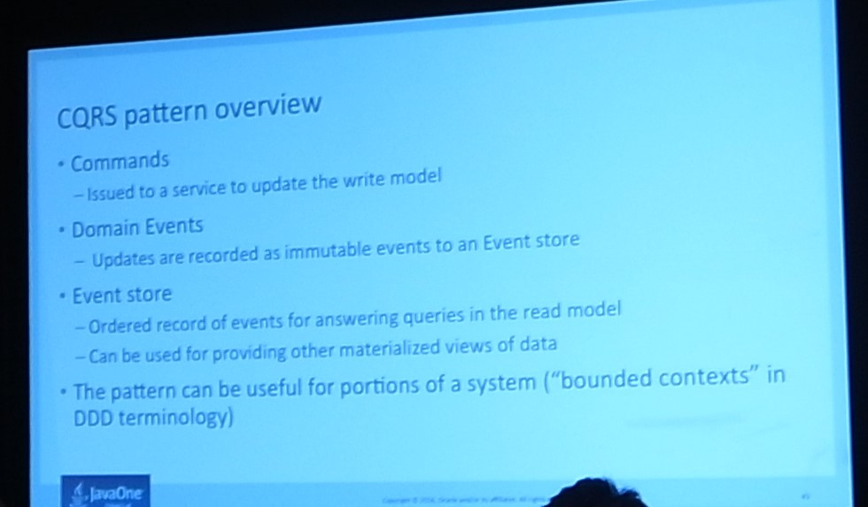

# 2日目

場所をMosconeからHilltonに会場を移してのセッション参加。
これからKeynoteまでは会場はずっとこっち。

## Rapid Development Tools for Java EE 8 [TUT1869]

JavaEEのExampleをNetBeansで開発しつつ動かしつつ、理解を深めるというセッション。

唐突に始まり、雑にセッションが始まったので、最初はついていきにくかったし、Installationの最後の部分で躓いて
結局動かせなかった。

GenerateSouceCodeウィンドウでソースコードの自動生成のための設定と実行ができる。
DBを作り込むことで画面側まで作ろうとするアプローチはそこまで新しくはないが、自動生成したものは中々にきれいだった。

再作成は既存のソースコードを削除する必要あり。

画面生成の部分もSQL書き換え等で対応できるよという話が出たが、そこまでくるとツールの使いこなしの話になってしまうので、
ツールの使いこなすか、初期化ツールとしての立ち位置にするかでプロジェクトの方針が必要。

このセッション、Toolsと銘打っている割にJPAModlerしか話さないのは少し期待が外れてしまった。
（昨日の印象から考えると、再考の余地があったはずなので、もう少し勘を働かせて受けるべきセッションを検討できるようになりたい。）

## Tuning G1GC

G1GCパワフルだけど、パワフルすぎて10%のコストがかかるそう。

jClarity CensumというツールでGCを分析できている。750USD/yearは高い気がするが、有用？

Mixed Collection
オブジェクトコピーコストの面で、CMSはFloatingGarbageが問題になったけど、G1GCはそれに加えてZombieオブジェクトも問題になりうるよ

ここを読んでまとめておこう
https://docs.oracle.com/javase/jp/8/docs/technotes/guides/vm/gctuning/g1_gc_tuning.html

## JDBC Next: A New Nonblocking API for Connecting to a Database

NonBlockingAPIは現状のJDBCAPIを置き換えるものではなく、共存するものを、
高スループットのアプリケーション向けに作成することを目標としている。またJavaSE上でビルドすることも目標。
（依存性を下げるということかな？）

parameter Markersはプレースホルダーと似ているけど、目的違うものなので、表記を変えている。
（が、今後開発をするなかで記法が変わるかもだから、今日のプレゼンpで見せているサンプルコードはもう二度と見られないかもねｗ。とのこと。

jdbc:oracle:nonblocking:@/javaone といったように、データソース取得の段階でNonBlockingの指定をURLでする予定。
扱う側ではBlockingとNonBlockingを気にせずに使えるのはメリットとデメリットありそう。

Futureで返すJDBC Nonblocking APIが何を返すのかはドライバーベンダー依存。仕様としては決まってないので、リストで結果が来た場合に途中の値を返すか最後の値のみを返すのかは決まってない。

JDBC NonBlockingAPIはJavaSE10からかもね？とのこと。
Java10?と表記していたので、まさかSE9にはさすがに間に合わないだろうし、JavaSE11になる可能性だってある。

GroupOperatorにした場合の処理の扱いはシングルスレッドかドライバー依存かをよく聞き取れなかった。
ユーザースレッドはblockingしないのは嬉しい反面、そっち側も考えないと結局スループットはあんまり変わらなくなりそうなのは注意したほうがいいかもと思うなどした。

## Java EE 8 Update

かなり大きな提案があったセッション

**こ内容はまだ提案段階なので、今後もコミュニティーへのフィードバックを基に変更される可能性があるもの**とのこと。次のセッションでも同様のことを述べており、かなり慎重になってこのセッションに望んでいるようだった。

### Java EE 8 Proposal の改定
 
JMSとMVCとManagementAPIをdropして、HealthChecking(死活監視)とConfiguration（設定の外部化）をaddするという方針。

### 提案された変更点

仕様が現状広く使われていなかったり、デプロイ粒度が大きくなること懸念したりしている点がDropの理由。そのかわりResiliency(システムのとしての柔軟性)を高めるための仕様や、マルチテナント型でのデプロイを目的とした仕様がAddすることが提案されている。

### 技術的に注力する領域
 
上記提案において注力するのはどういった点であるかを見やすくしたもの。

### 聴講者からの質問等
上記提案について、質問や意見が紛糾。いつまでリリースまでのスケジュールの話や、JCacheどうするのか等々、コンテキストについていけず、このあたりをよく理解をしているひとの解説を望みます。

### フィードバックについて

http://glassfish.org/survey

上記リンクからどうぞ。私もフィードバックしましたが、20分程度の無記名式アンケートで、「自分はどう考えているんだろう」と再考する良い機会になりました。

## Enterprise Java for the Cloud

個人的に気になった点が2つ

### NoSQLのサポート
 
 
画像が荒いのでそのうちきれいなものに差し替えたい。
大きくは3層になっているよう。
1. javax.persistence.nosqlパッケージにcoreAPIを置く
2. NoSQLの種類(Graph型やDocument型やColumn型)についてはNoSQLカテゴリーAPIで吸収
3. データベース特有のAPIを各NoSQLベンダーがドライバーを実装し、カテゴリーAPIにぶら下がる

1日目に聞いていたDienaも目指すところは一緒だったが、あれはどちらかと言うと2層で頑張るパターンだったので、この3層のほうがまだ現実味があるかなと思う。あとはNoSQLベンダーをどう巻き込むかが課題か。

### CQRSについて
1日目のセッションでもよく耳にしたCQRS。システムをCRUDではなくCQRSで捉えて、参照系と更新系にシステムを分割することを検討してみましょうという話だったと理解している。

DDDで言うところの境界づけられたコンテキストだよと説明されているが、そんなに雑なのか

CQRSについては勉強不足なので、自分の理解を深めたいところ。

## The Hacker’s Guide to Session Hijacking in Java EE
眠気と気力が底をつきたので、聴講をパス。

https://www.youtube.com/watch?v=GNmU5vwZua8

で聞けるらしい

## Learn About DI and Web Frameworks Through Implementation
@kisさんのゆるいけどゆるくない。ライブコーディングで、その場で出た環境依存のバグを潰しながら進むという離れ業が披露された。

BOFをあまり良く知らなかったんだけど、入室チェックもないユルユル運営なのが心地よかった。

「DIの再発明から得た再発見」という内容のほとんどはこのリンクで語られている。
http://d.hatena.ne.jp/nowokay/20160406

DIについては実装経験もないので、「普通にあって使えるもの」程度の認識しかないので、「在るべき論」を探るべきというメッセージは骨身にしみたし、何よりRegistrationなしにセッションスピーカーになった@kisさんの勇気と胆力には心が震えざるを得なかった。

## その他

### Java Hub
今日は殆どセッション聴講だけだったので、あまり回る暇がなく、適当に誘われたくじでfire TV stickが当たったぐらいが成果です。
 
もう少し話がしたいんだけど、相手の会話スピードについて行けずしどろもどろしてしまうので、明日はせめて相手からの問いかけに積極的に答えて、自分から質問しに行こう。

### 昼食
これはカロリーを摂取することだけに重きをおいて作られたものである。
 

### 夕食
Twitter上でつぶやいていたらひょんなことから@bitter_foxさんとご飯を食べに行くことになり、初日に行ったステーキ屋さんでハンバーガーを食べた。相変わらずの大味。肉味。
 

二人で話すと私の話が止まらなかったので「我ながら話すことに植えているんだなぁ」と実感。外国に来てまで日本人と話してもなぁと思っていたけど、結局コミュニケーション殆どできていないので、一日一回ぐらいは誰かと話すタイミングを言語を問わず作りたい。
