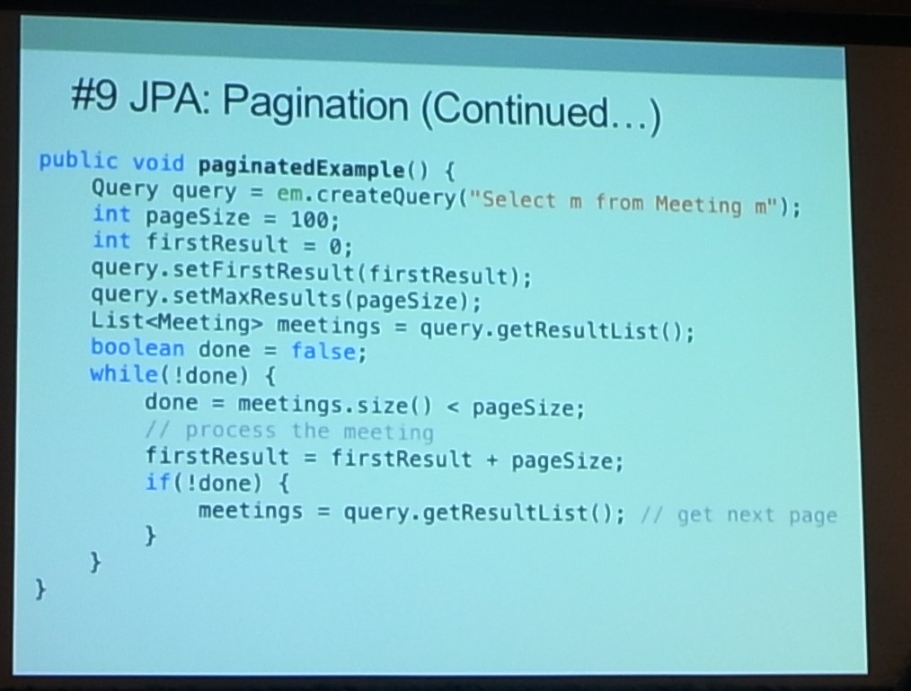

# 4日目

オフィス訪問とAppreciation Partyのため昨日に引き続き内容薄め

## Top 50 Java EE 7 Best Practices [CON5669]
２年前のJavaOneで[発表した内容]( http://www.slideshare.net/rcuprak/con1947)発表した内容のアップデートということで、EJBだけだったものをスコープを広げてお届けするよという話。

頑張ってメモしたものの、一部欠けてしまったが、一応書き下したものを記載。
スピーカーの方も後日アップロードするよとはおっしゃっていたので、少し体力の無駄感があったかも。

### JAX-RS
レスポンスを圧縮しよう、
RESTFULサービスをセキュアにするためにトークンを使ったりJAASに対応したり。

@StateLessと@Pathは一緒に使おう。
プールされて、スレッドセーフになって、監視できる

非同期なAPIゲートウェイにするために
Future<T>を使って、DTOに結果を集約しよう
返すときはAsyncで

### JPA
JAPのページネーション

テーブル結合がたくさんある場合、遅延評価を用いることでフォーマンスの低下を防ぐこともできる

子データを管理するためにカスケードレベルを無視してはいけない

entytygraphもあるよ

DaoでCRUD操作を定義しよう

hashcodeとequalsは等価性を検討した上で正しく実装しよう

楽観同時実行処理制御
自らロールバックしない。@Versionによる楽観ロックをおこなう

悲観同時実行処理制御
PESSIMISTIC_READ, PESSIMISTIC_WRITE
Timeouｔつけよう。

Mapping Inheritance
Singleテーブル、Joinedテーブル、Table-Per-Classのアプローチあ
denormalized させたほうがパフォーマンス上がることもある。

JPACache
persistence.xmlでshared-cache-modeをしっかり使おう
＠CacheableをJPAクラスにつけてキャッシュ可能か明示する

persisting enum
@converterはAttributeConverter<X,Y>を実装する
(Xはアプリケーションのコード、Yはデータベースのコード)

### EJB
トランザクションハンドリング
EJBはトランザクション管理できるので、正しいレイヤーで実施
Default Requiredであることを忘れてはいけない

Stateless thread Safety
stateless beansはマネージソースにプールされるよ
（プーリングについても、どれだけプールするかの初期値を設定可能）

非同期通信
@Asyncdで指定。返り値はFuture<T>を使おう

セキュリティのために手書きでセキュリティ実装を書かない。
EEサーバーはコンテナから渡されるPrincipalやrolesを信頼するようにできているので注意。
写真

Avoid Lengthy Initializaiton
＠PostConｓｔruｃtで初期化を遅延させられるよ。
@startup @singletonにしておいて、initに@Postconstructつけるとできるよ

### CDI
Observers
In-memory event processing
Very reactive

producer+Cache
use producer to customize creation of an object

interceptors
limit to cross-cutting concerns
do not use to change business logic
ログ出力等に使う程度に押さえるべき。

decorators
use to enhance or decorate existing
oepn-close principle
donot use for cross cutting concerns

### その他
bean discovery
使い分けしよう

batch:javaee not se
batchAPI使おう
cron like schecdule on ejb method

META-inf/batch-jobs/processInvoices.xml

baｔｃｈ：ベストプラクティス
@Roleでセキュアに使用する

### JAX-B

Data & Time Representation
USE XML Gregorian Calendar for dates
avoid java.util.date,Calendar

SOAP Faults
syashin

SOAPが失敗したときのため、SOAPmesageHandlerを利用する。

securityはRole使おう

largefile
application/octet-stream使おう

### その他
thread
containerがかんりできなくなるので自らスレッドを作らない。使うならManageThreadFactoryを使ってスレッドを生成する。

Distributed Cache
分散システムを見越してシングルトンを　グローバルなシングルトンとして扱うわない
JCacheの実装を使う

負荷テストもしっかり行うことで、システムが知らず知らずに遅くなることを防ごう。

Integration TestingはArquillianを使おう

JavaEE Tutorialコンテンツは見るのが辛い。
全体では918頁もあるので、TOC（目次）をしっかり見よう。
TOCは３0ページ程度の素晴らしいまとめ。

小さい（価値の低い）アプリケーションなんてないので、現状に追われて安易な選択をしないように。
JavaEEの仕様一つ一つにはしっかりした理由があります。

## Refactoring to Java 8

JetBrainsの中の人
[資料](http://bit.ly/refJ8)

Java8の記法をチームに取り入れるに当たって観点を
- 可読性
- コードの減少量
- パフォーマンス
- 学習コスト
として一緒に考えていきましょうというセッションだった。

セッションを見ていた個人的な感想としては
- 可読性
 - チームの習熟度に起因するので評価しきれない。チームによる。
- コードの減少量
 - Java8は確実に減る
- パフォーマンス
 - Java8の記法で書いたコードが軒並み良くなるわけではない。評価する点によって早くもなるし、遅くもなる
- 学習コスト
 - デモで見た限りはIntelliJのコード置換は便利だし学習コストに寄与するものだと実感

結局セッション自体のまとめも、「当てはめるべきかはシステムによるよね」という結果には同意するんだけど、
コレでいいんだろうか感は正直拭えない。

デモは時々止まることがあってあっちこっち画面を触っていたので、少しわかりにくい部分もあったが、概ね内容は把握できたので、発表自体はすごく良かったとは思う。。

## Putting API Design First With Swagger

このセッションで初めてYosemite部屋を利用。柱が二本立っているのが存在感を放っており、早めに入室できたので前に座って画面見えない問題を回避した。

[デモコード](https://github.com/fehguy/javaone-inflector-demo)

Code First：コードが常に正でドキュメントは後からついてくる

Design First:ドキュメントが常に正で、コードは後からついてくる

スピーカーとしてはCode FirstとDesign Firstで比較した場合、 ソースコードがアノテーションだらけになるので、DesignFirstのほうが優位であると信じているとのこと。

Swaggerの基本から、swagger-ui等のエコシステム、swagger-inlectorを利用したシステムのデモ（Swaggerを変更した部分をswagger-inflectorが感知し、その変更に応じてソースコードが変更されたり、実装のモック生成されたりしていた）等が紹介され、「Swaggerと、Design Firstは相性がいいよ」という論には納得がいった。

なお、swagger-inlectorはJerseyを拡張したものとのこと。

## Code-Level Security Games and Puzzles in Java [CON2806]
昨年もやったセッションのようだった。（使用していた投票システムは2015になっていたので）

出題としては状態遷移図上の問題、エスケープ／サニタイズ問題、バックスペースによる悪意のあるリクエストを基に問題化され、ソースコード上でどの行がおかしいかを投票するシステムを用いてセッションが進んだ。

エスケープ・サニタイズ問題はすぐに気がついたが、それ以外はあてが外れてしまってセキュリティ関係の知識経験の無さが露呈してしまったものの、間違えた恥ずかしさ以上にスピーカーと聴講側を超えた全体で議論するような場になっていたことにとても感動してしまった。まさかりを投げ合うような議論はお互いの体力が必要なので、日本で同様のセッションをするのは少し難しいかなー。

人対人の対決のあとは、該当するソースコードを静的解析で読み込ませたときの結果を表示しており、各問題でしっかりまとめをしつつ、進められていたのは良かった。私も参考にします。

## The Quest for Very Large Heaps

sparkやRedis、Hazelcastなどいろんな製品がメモリを大量に消費することが前提でシステムが構築されている。。In-memory computingのユースケースはFinance,Pricing,SupplyChainなど、大量の情報やデータを扱うこ。と。

Java9ではNUMA Architectureでやるよ。今は複数CPUで同一共有メモリ上で処理しているけど、今後はCPUにたいして、メモリが割り当てられてその上で、DBはpartitionされている状況で処理をすることを想定しているとのこと。

JavaHeapからLiveDataHeapというキーワードがでており、
SharedStackを１スレッドで捌いていている図と、SharedStack with LockFreeにして、他のCPUからSharedStackに矢印が伸びている画像があったが、内容が理解できていない。

聞いていて、話している規模の大きさと現状のGCへの理解の少なさから理解があっているのかも怪しいので、帰国したら資料ともども見直したい。

## Oracle Appreciation Party

AT & T Parkに行ったら、歌っている人がいました。見ている人はもっといました。

個人的に歌は聞くよりも歌う派なので、歌手のライブの類に行ったことがなかったんですが、熱狂的になっている人を見るだけでも色々と社会経験になりました。
