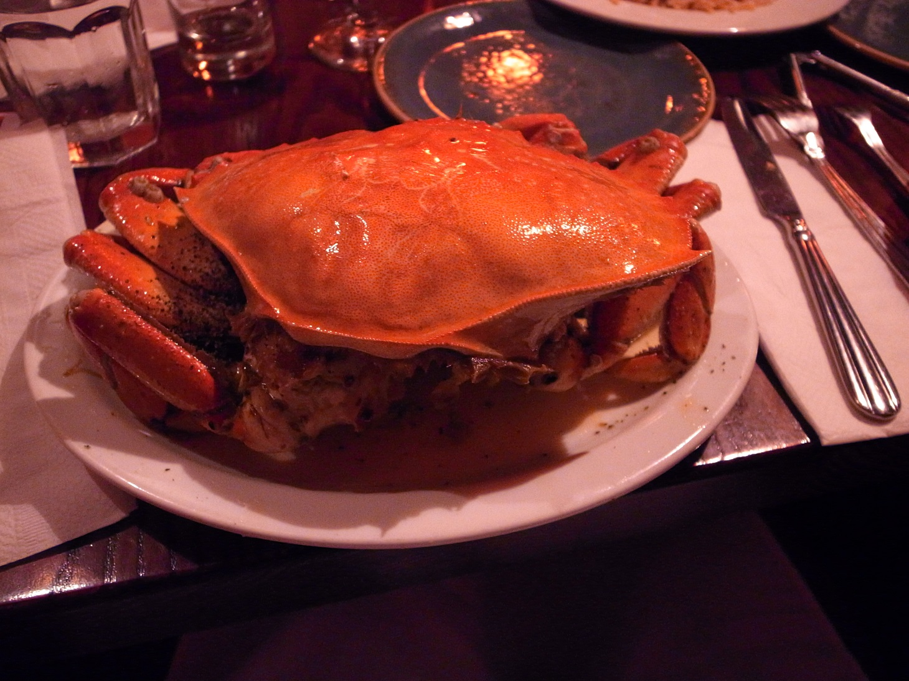

# 5日目

## Java Community Keynote
IBMの真面目セッションから始まる。
Bluemix使ってくれよな！J9もオープンソースになるし、OMR（初見だった。）がもっと強力な開発環境を提供していってIBM SDKを提供していくつもりだよという話だったと理解している。

中盤に入る前のJava Japan Tourの動画で少しうれしくなった。
中盤～後半はStarWarsネタで盛り上がり。大人でもあんなにお芝居で楽しめるって素晴らしいことですね。

## Stay Sane; Write Solid Tests
中身のあるテストをかけという話。

AssertJを使ったコードで紹介しており、hamcrestよりもコードを減らしてくれるとのこと。やっかいなDead lockの検知もできるようで結構便利っぽいので知っておきたい。

また[betamax](https://github.com/betamaxteam/betamax)という、REST APIを利用した場合のテストをする場合のモックサーバー用のフレームワークの紹介があった。

大筋としては「中身のあるテストを書く」ために、実践していることの紹介だった。AssertJの紹介っぽいセッションにも見えたが、
- ストーリーが分かるテストにするべき
- 表現豊かなアサーションを使用する
- 誤った抽象化やボイラープレートの使用は避ける
- テストかくあるべき
 - 再実行可能で
 - 確実で
 - 可読性のある
とまとめられており、スピーカーの苦労が垣間見えるセッションだった。

## Putting Hypermedia Back in REST with JAX-RS
[デモコード](http://github.com/sdaschner/jaxrs-hypermedia)

最初はHypermedia APIの解説から。でてきからかなりの時間をこのHypermediaAPIの解説に費やしており、実装自体は最後の10分程度でサクッと終わらせてしまった。最初からこの構成だったようだ。

[Siren](http://github.com/kevinswiber/siren)の仕様をJAX-RSで実装しておりj実装自体やアーキテクチャについてはそこまで高度なことはしていなかった。あくまでHyperMediaAPIを広めるためのセッションだったようだ

個人的な理解としては
- HyperMedia API
 - 文書の内容と文書同士の関係性
- HTML
 - 文書構造の指定
- CSS
 - 文書スタイルの指定
だと認識した。

コンピューターが情報を自動クロールするための仕様の一つで、スクレイピングよりは良いと感じた。

## 蟹One
MuniMetroで会場に向かう。クリッパーがなかったのでチケット購入したけど、帰り道の分を購入し忘れたので、買っておけばよかったと少し公開しました。

蟹は美味しかったです。にんにくと油と胡椒って完全に野生に戻れるメニューで良いですね。

# JavaOne参加まとめ

結構気軽に行ってみたけど、知らない分野や実際に触れたことがない技術については「？」としかならないので、登録したセッションをざっくり眺めたら少し調べておくと良い。一応各セッションの冒頭でも初学者向けに説明をしてくれることも多々あるものの、むしろ混乱することが多かった。

JavaEE中心にGCとJigsawに少し参加した。JavaEEは比較的大きな提案があったので、収穫はあった。GCは半分ぐらい。Jigsawはあまり頭に入ってこず。
全体的な方針としては（セッションを選んでいたときにも感じていたとおり）、よりマイクロに、巨大なデータを扱い、安全に、早く、価値を届けるために進化するというテーマがあったように思う。少しクラウドに傾倒しすぎている感もあったが、個々のセッションは魅力的で、技術的で、何よりワクワクさせてくれた。

英語については、恐怖心がない方だったが、やはり会話できるレベルで自信がなかったことには少し後悔している。（会話能力云々よりも、自ら喋ろうとする気概の話）聞いていて「結構雑な文法だな」と思うことが多少なりともあったけど、伝わってくることがまず第一なので自信を持って話すことが何より大事。最終日前ぐらいになると開き直りもあったので、食事のときに同じテーブルになった知らない人と少し話したり、スーパーで少し話をしてみたりするようにできたので、より一層の努力が求められる。

来年も是非参加したい。
